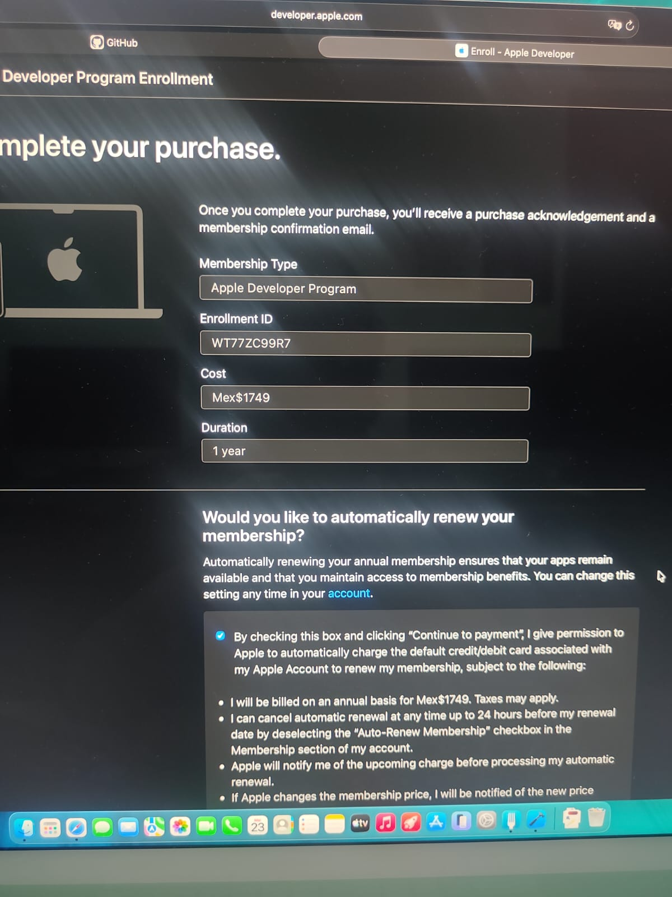
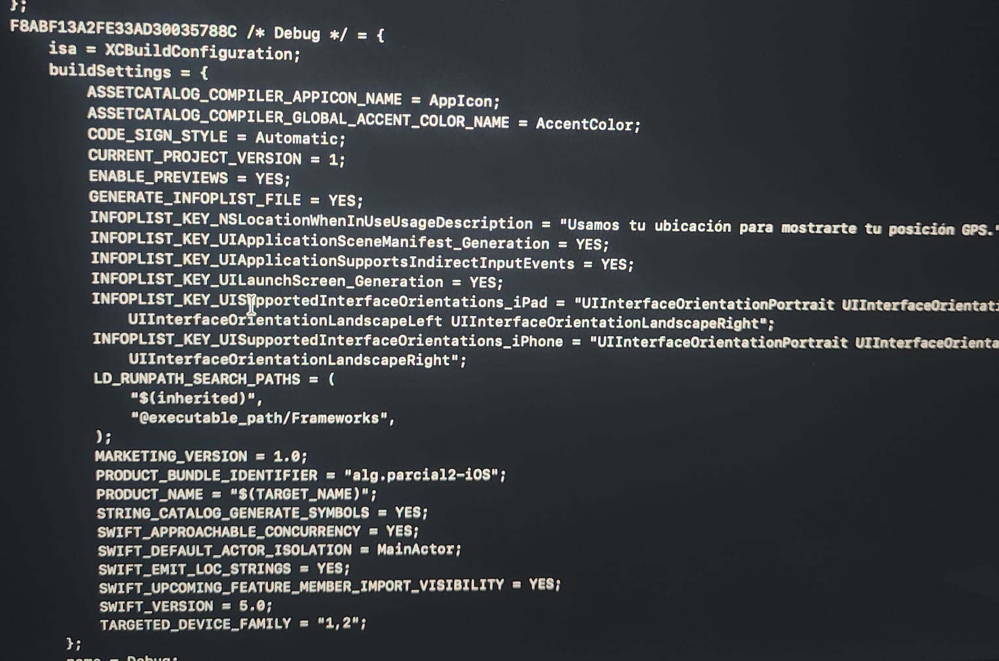

# Sesión 10: Configuración de Ficha y Preparación para App Store

## Información del Alumno
* *Nombre:* Alondra Correa Carranza
* *Carrera:* Ingeniería en Software
* *Materia:* Desarrollo Móvil (iOS Nativo)
* *Entregable:* Reporte de Proceso de Membresía y Localización de Propiedades (Info.plist)

---

## Descripción de la Actividad
Debido a la actualización de los requisitos de la plataforma de Apple que restringen el flujo completo de empaquetado (Product > Archive) únicamente a cuentas con membresía activa de pago, la dinámica de esta sesión se enfocó en simular el entorno previo a la distribución comercial y en la auditoría técnica de los archivos de configuración del proyecto en Xcode.

Se completaron con éxito los siguientes objetivos prácticos:
1. *Flujo de Registro en Apple Developer Program:* Inicio del proceso de inscripción comercial, alcanzando la etapa previa a la pasarela de pago para validar la identidad digital y disponibilidad del Apple ID.
2. *Auditoría del Archivo de Propiedades:* Localización e inspección del archivo de configuración Info.plist (Property List) dentro del entorno de desarrollo de Xcode para la gestión de permisos y llaves del sistema.

---

## Evidencias de la Tarea

### 1. Registro en el Apple Developer Program (Paso Previo al Pago)
Muestra el panel web oficial con la cuenta de desarrollador activa y el paso final de confirmación previo a la transacción de la membresía anual.




### 2. Localización de Propiedades de Configuración en el Proyecto

Nota:debido a que no me sale las tablas y opciones, trate de buscarlo en el codigo que me daba, esto es lo que pude identificar

A continuación, se identifican lo que corresponde a los requisitos de la Sesión 10:

#### Configuración de Versión y Build Number:
```text
MARKETING_VERSION = 1.0;
CURRENT_PROJECT_VERSION = 1;

Versión Comercial (CFBundleShortVersionString): Identificada en la configuración como MARKETING_VERSION = 1.0;. Es el número de versión visible para el usuario final en la tienda.

Número de Build (CFBundleVersion): Identificado como CURRENT_PROJECT_VERSION = 1;. Es el identificador incremental interno que exige Apple para controlar el historial de cargas y evitar duplicados



## Conceptos Clave Identificados

* *Membresía de Apple ($99 USD/año):* Es el esquema de licenciamiento obligatorio para poder firmar aplicaciones con un perfil de distribución real, acceder al portal completo de Certificates, IDs & Profiles en la web, crear fichas en App Store Connect e implementar compras integradas o notificaciones push en producción.
* *Property List (Info.plist):* Archivo XML clave en la raíz del bundle de iOS que contiene pares llave-valor (Key-Value). Define configuraciones críticas del sistema operativo como el nombre en pantalla (Bundle display name), la orientación de la interfaz, versiones de compilación, y los mensajes obligatorios de privacidad (Privacy - ... Usage Description) que se le muestran al usuario cuando la app solicita acceso a hardware como los sensores o la cámara.
